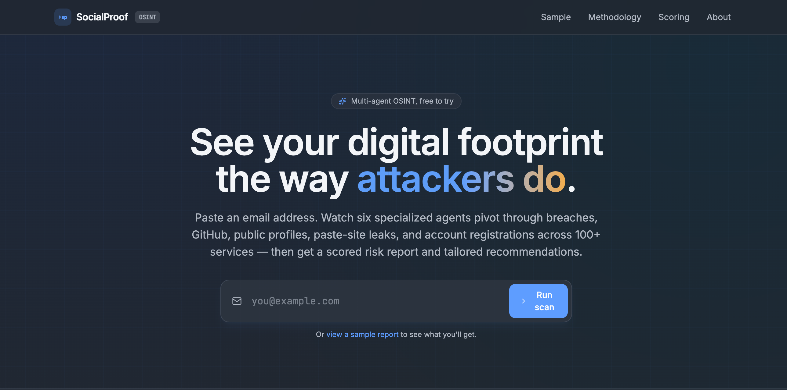
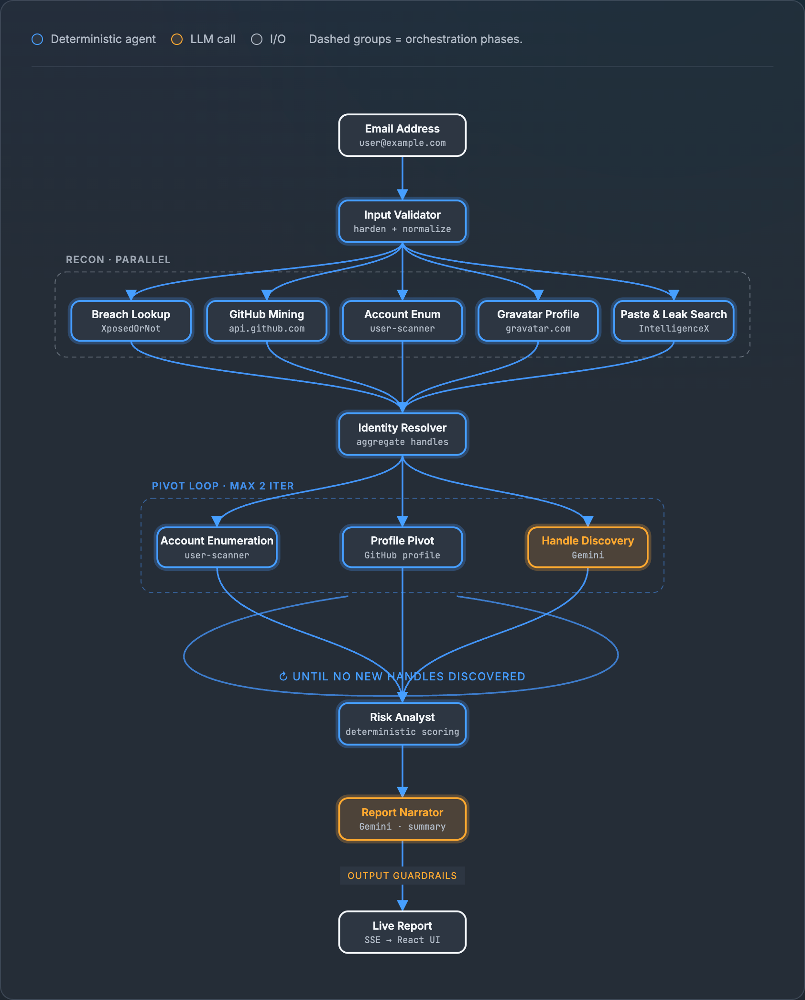
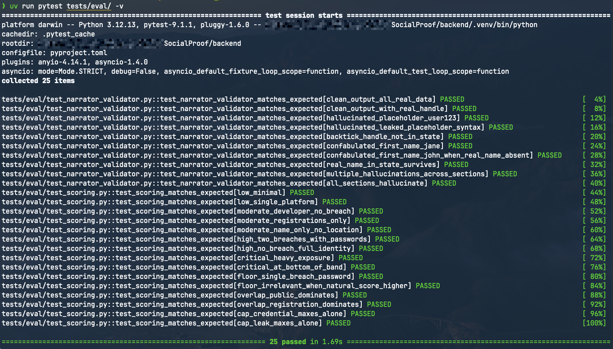

<p align="center">
  
</p>

# SocialProof

> [!NOTE]
> **Capstone submission** — 5-Day AI Agents: Intensive Vibe Coding Course With Google · June 15–19, 2026
>
> Submitted by Kashif Memon

> [!TIP]
> **Live demo**: <https://socialproof-web-1010516973639.us-east1.run.app>

A multi-agent OSINT scanner built on Google's Agent Development Kit
(ADK). Six specialized agents stream findings in parallel through
breach, paste, GitHub, and account-enumeration sources. A
deterministic Python scorer produces the risk number so the same
email always yields the same score; the only LLM call in the report
path is guarded by a section-level output validator that drops
hallucinated handles before the user sees them. Everything the code
depends on is tested — 25 pytest fixtures cover the scorer and the
guardrail.

Point it at an email you own. It tells you what an attacker can already
see, ranks the exposure 0–100, and hands you a prioritized action list.

## Table of contents

- [What it does](#what-it-does)
- [Tech stack](#tech-stack)
- [Quick start](#quick-start)
- [Architecture](#architecture)
- [Scoring](#scoring)
- [Safety and security](#safety-and-security)
- [Testing](#testing)
- [Layout](#layout)
- [License](#license)

## What it does

Six specialized agents fan out and answer:

- *Has this email appeared in known data breaches?*
- *What GitHub commits and profiles tie back to it?*
- *Where does it show up on paste sites, public leaks, or the darknet?*
- *Which popular public services is it registered on?*
- *Which public accounts share the discovered usernames?*
- *What real-name and location data is publicly attached to those profiles?*

Findings flow into a deterministic scorer (four-category, 0–25 each,
summing to 0–100). A narrator agent writes a five-section markdown
executive summary; a section-level output validator rejects any
hallucinated handles, names, or placeholder tokens before the report
reaches the user. If the LLM fails entirely, the deterministic report
still renders.

<p align="center">
  
</p>

## Tech stack

**Backend**
- Python 3.11
- Google Agent Development Kit (ADK)
- Gemini (narrator + handle discovery)
- FastAPI + SSE streaming
- httpx, uv, slowapi

**Frontend**
- React 19
- TanStack Start (SSR + file-based routing)
- Vite
- Tailwind CSS 4
- lucide-react

**Data sources**
- XposedOrNot — breach lookup
- IntelligenceX (free tier) — paste sites, public leaks, darknet
- GitHub REST — commit search + profile
- Gravatar — public profile JSON
- [user-scanner](https://github.com/kaifcodec/user-scanner) (MIT, PyPI) — account existence across 100+ services

## Quick start

Setup, run, and deploy instructions live in [`RUN.md`](./RUN.md).

## Architecture

```
Email  →  Recon (5 parallel sources)
       →  Identity aggregation
       →  Pivot loop  (max 2 iter, LLM-assisted handle discovery)
       →  Deterministic risk score
       →  LLM narrator + output guardrail
       →  Live report
```

Two agents call Gemini (`handle_discovery`, `narrator`) — everything
else is deterministic Python. The narrator's output passes through a
section-level validator that drops any section referencing a handle,
name, or service not present in the scan's structured state; the
deterministic risk report survives even when the LLM fails.

The animated version of the flow, with per-stage descriptions, lives
at **`/methodology`** in the running app.

<p align="center">
  
</p>

## Scoring

The 0–100 risk score is the sum of four sub-scores, each capped at 25:

| Category | Signals |
|---|---|
| Credential Exposure | Breach count, password leakage, distinct data classes |
| Leak Presence | Visible paste/darknet hits, additional leak-corpus counts |
| Identity Correlation | Real name, location, linked usernames (with a name+location interaction bonus) |
| Attack Surface | Public accounts + service registrations (primary/secondary decomposition) |

Reaching **Critical (70+)** requires exposure in more than one
dimension — a maxed single category alone tops out at 25. Logarithmic
diminishing returns on count signals stop repeated hits from
dominating. A **floor rule** forces at least Moderate (25) whenever
any breach exposed passwords.

Full formula, worked example, and severity bands documented on the
`/score` page in the running app.

## Safety and security

- **Deterministic scoring.** Same email → same score, every run. No
  LLM in the scoring path.
- **LLM output guardrail.** Narrator output is validated section-by-
  section; hallucinated handles, names, and placeholder tokens are
  dropped rather than shipped to the user.
- **Double-layer input validation.** Email is validated at the HTTP
  boundary and again in the seed agent — allowlist regex, length cap,
  control-char rejection, catches embedded `\nignore previous`
  patterns.
- **Rate limiting.** `POST /api/scan` is limited to 5/min and 30/hour
  per IP via slowapi.
- **Security headers.** Every response carries `Content-Security-
  Policy`, `X-Frame-Options`, `X-Content-Type-Options`,
  `Referrer-Policy`, and `Permissions-Policy`.
- **Email out of URLs.** The scan URL contains only an opaque session
  id; the email itself is held in tab-scoped `sessionStorage` so it
  doesn't leak via `Referer`, browser history, or shared screenshots.
- **IntelligenceX metadata only.** Records are listed but never
  downloaded, even when the endpoint would allow it.

## Testing

Two pytest suites under [`backend/tests/eval/`](./backend/tests/eval/):

| Suite | Cases | What it proves |
|---|---|---|
| Scoring reproducibility | 15 | `correlate_risk` matches expected score + severity across every band, category cap, and the floor rule |
| Narrator output guardrail | 10 | `_filter_narrator_output` catches placeholder tokens, backtick-quoted invented handles, and confabulated first names — while letting legitimate output through |

```bash
cd backend && uv run pytest tests/eval/
# 25 passed in ~1.7s
```

<p align="center">
  
</p>

## Layout

```
SocialProof/
├── backend/
│   ├── app/
│   │   ├── agents/           # ADK agent tree (recon, identity, pivot, analyst, narrator)
│   │   ├── osint/            # Per-source lookups + the deterministic scorer
│   │   ├── server.py         # FastAPI + SSE + rate limiting + security headers
│   │   └── cache.py          # Same-day per-email replay cache
│   └── tests/eval/           # Scoring + guardrail evals (25 fixtures)
├── frontend/
│   └── src/
│       ├── routes/           # Landing, sample, scan, score, methodology, about, author
│       ├── components/       # Agent cards, risk gauge, methodology diagram, ...
│       └── hooks/            # useAdkScan (SSE consumer)
└── assets/
    ├── imgs/                 # Logo, cover, README hero
    └── imgs/screenshots/     # Kaggle Writeup + README screenshots
```

## See also

- [`RUN.md`](./RUN.md) — step-by-step run guide and troubleshooting
- [`backend/README.md`](./backend/README.md) — backend setup, ADK details, deploy notes
- `/methodology` page — animated agent flow with per-stage descriptions
- `/score` page — full scoring formula with worked example
- `/about` page — the tool's scope, sources, and limits
- `/sample` page — pre-recorded high- and low-risk report fixtures

## License

MIT. See [`LICENSE`](./LICENSE).
